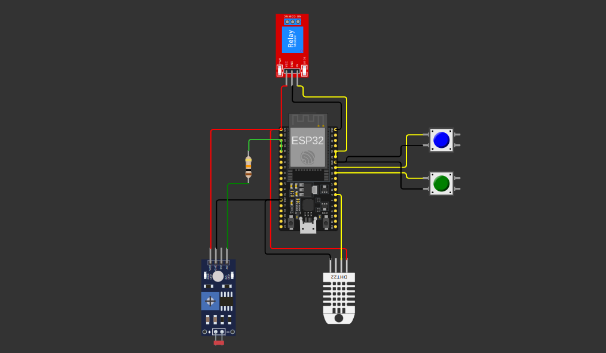

# activity-fiap-ai-p3a1

> **Note:**  
> This project is part of the **Artificial Intelligence** course at [FIAP](https://github.com/fiap) - Online 2024. It is the "**Phase 3** Activity Chapter 1 - Building an Agricultural Machine."

## Project Overview

The objective is to develop an automated, intelligent irrigation system that uses real-time data from simulated sensors to optimize water usage based on soil moisture, nutrient levels (P and K), and pH. The system will collect data from a network of simulated sensors on Wokwi.com, store this data in a SQL database, and control irrigation according to sensor readings. Additionally, it will provide data visualization through a Python dashboard and include weather-based irrigation control using an external API.

### Irrigation System

For details on the irrigation control logic, see [docs/irrigation.md](docs/irrigation.md), where we outline how humidity, nutrient levels, and pH conditions are monitored to optimize watering schedules and maintain soil health effectively.

### Sensor Substitutions

For information on sensor substitutions and their impact on system accuracy, see [docs/sensor-substitutions.md](docs/sensor-substitutions.md), where we explain how alternative sensors like buttons and LDRs were used to simulate nutrient and pH levels, along with the implications for data precision in the irrigation system.

### Circuit



### Technical Details

1. **Circuit and Embedded Code**:
   - Implemented with [Wokwi](https://wokwi.com/).

2. **Database Structure**:
   - Created main tables such as `Producers`, `Crops`, `Sensors`, `SensorReadings`, `ApplicationAdjustments`, and `IrrigationHistory`.
   - Implemented CRUD operations to manage sensor data and irrigation history.

3. **Dashboard in Dash**:
   - **Visualization Charts**: Line, bar, and area charts monitor real-time soil moisture readings.
   - **Irrigation History Table**: Displays the activation history of irrigation.
   - **Irrigation Recommendation**: A function analyzes soil moisture and provides irrigation recommendations, visually indicated on the dashboard.

4. **Integration with OpenWeather API**:
   - Added a dashboard section showing rainfall, humidity, and temperature forecasts using OpenWeather API.
   - **Date and Time Formatting**: Adapted dates to Brazilian format (`dd/mm/yyyy hh:mm`) for better readability.

### Testing

1. **OpenWeather API Connectivity Tests**:
   - Used `curl` and Python tests to ensure the API connection is functional and that data is correctly formatted.

2. **Dashboard Data Validation**:
   - Validated dashboard chart and table visualizations.
   - Checked irrigation recommendation logic and weather forecast display.

3. **Database Read Operations**:
   - Tested reading of data with [SQLTools](https://marketplace.visualstudio.com/items?itemName=mtxr.sqltools), focusing on irrigation history to ensure data accuracy on the dashboard.

## Installation

Before proceeding, ensure the following prerequisites are installed on your system:

- [Git](https://git-scm.com/downloads)
- [Docker](https://docs.docker.com/)
- [Docker Compose](https://docs.docker.com/compose)

Additional tools for setup:

- [VS Code](https://code.visualstudio.com/download)
- [Python 3.x](https://www.python.org/)

Consider installing these VS Code extensions:

- [SQLTools](https://marketplace.visualstudio.com/items?itemName=mtxr.sqltools) (optional)
  - [SQLTools Oracle Driver](https://marketplace.visualstudio.com/items?itemName=Oracle.oracledevtools)
  - [SQLTools MySQL Driver](https://marketplace.visualstudio.com/items?itemName=mtxr.sqltools-driver-mysql)

To clone the repository to your local machine:

```sh
git clone https://github.com/farm-solutions/activity-fiap-ai-p3a1.git
cd activity-fiap-ai-p3a1/
```

## Usage

### Setup

1. **Define environment variables**:
   ```sh
   cp .env.example .env
   ```
   Edit the `.env` file to set environment variables as needed, especially `OPENWEATHER_API_KEY`. For more information on OpenWeatherAPI, see [here](https://openweathermap.org/api).

2. **Database Setup (Oracle)**:
   - Open VS Code and follow these steps:
     1. Open the Command Palette:
        - **Ctrl + Shift + P** (Windows/Linux)
        - **Cmd + Shift + P** (macOS)
     2. Select **Tasks: Run**.
     3. Choose:
        - **Run Oracle container** to start the database.
        - **Stop Oracle container** to stop it when done.

3. **Create and Activate Virtual Environment**:
   ```sh
   python3 -m venv .venv
   source .venv/bin/activate  # On Windows, use `.venv\Scripts\activate`
   ```

4. **Install dependencies**:
   ```bash
   pip install -r requirements.txt
   ```

5. **Insert Sample Data**:
   - Execute the Python script:
      ```bash
      python src/populate_db.py
      ```

### Solutions

1. **Running the Dashboard**:
   - Start the dashboard with:
     ```bash
     python src/dashboard.py
     ```

2. **Using OpenWeather API Integration**:
   - Weather forecasts will automatically display on the dashboard and update every 10 seconds.
   - Irrigation recommendations are adjusted based on humidity and rain forecast.

3. **ESP32**:
   - Project link on Wokwi: [Wokwi Project](https://wokwi.com/projects/413455638981848065)
   - Access the code in the `embedded/` folder.

## Observations

- MySQL integration needs SQL adjustments.

## Group 4 - Members:

- [Caio Rodrigues Castro](https://www.linkedin.com/in/caiorcastro/) 
- [Ederson Luiz Badeca dos Santos](https://www.linkedin.com/in/ederson-badeca/)
- [Felipe Soares Nascimento](https://www.linkedin.com/in/digitalmanagerfelipesoares/)
- [Lucas Ferreira Hillesheim](https://www.linkedin.com/in/lfhillesheim/)
- [Luís Emidio](https://www.linkedin.com/in/luisfuturist/)

## Professors

- **Tutor**: [Lucas Gomes Moreira](https://www.linkedin.com/in/lucas-gomes-moreira-15a8452a/)
- **Coordinator**: [André Godoi](https://www.linkedin.com/in/profandregodoi/)

## License

This project is licensed under the [Creative Commons Attribution 4.0 International](http://creativecommons.org/licenses/by/4.0/?ref=chooser-v1).

<p xmlns:cc="http://creativecommons.org/ns#" xmlns:dct="http://purl.org/dc/terms/"><a property="dct:title" rel="cc:attributionURL" href="https://github.com/agodoi/template">MODELO GIT FIAP</a> por <a rel="cc:attributionURL dct:creator" property="cc:attributionName" href="https://fiap.com.br">Fiap</a> está licenciado sobre <a href="http://creativecommons.org/licenses/by/4.0/?ref=chooser-v1" target="_blank" rel="license noopener noreferrer" style="display:inline-block;">Attribution 4.0 International</a>.</p>
